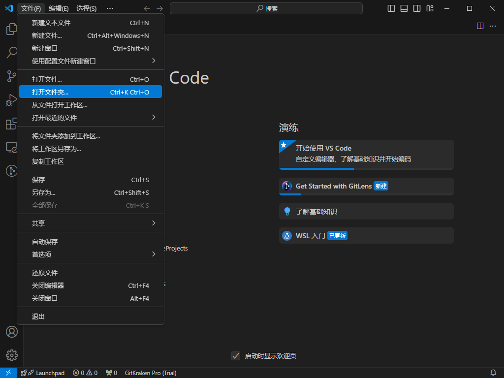
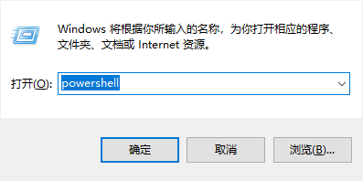
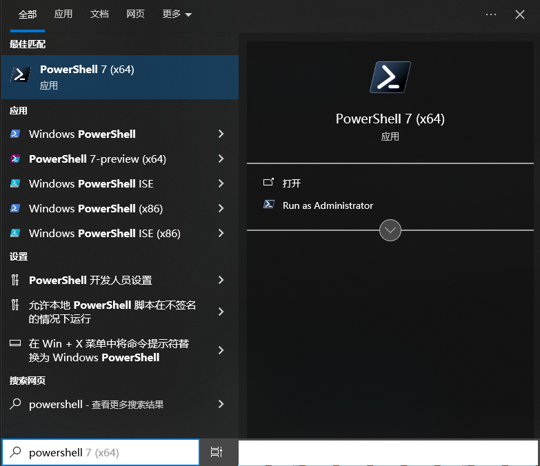
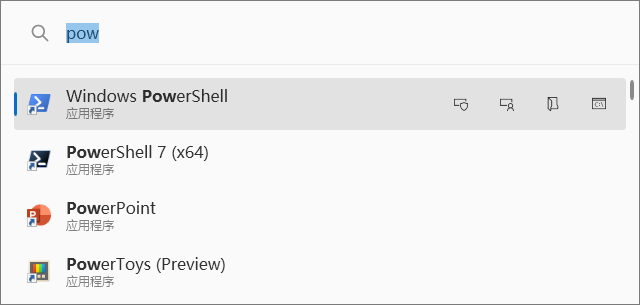
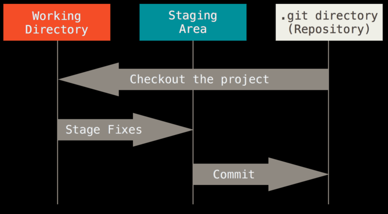

# Github的使用

> [!IMPORTANT]
> 阅读本文前请确保下述操作已完成。
> 1. 安装 [Git](https://git-scm.com/)。
> 2. 注册 [Github](https://www.github.com) 账号。

[[toc]]

## 1. 如何编辑本文档？

// TODO 施工中

### 1.2 使用VsCode 编辑本文档

```bash
cd <文档路径>
code .
```
或者点击图标后打开VsCode，打开指定文件夹


## 2. Git
> [!WARNING]
> 每一次提交都会使用这些信息，后续如果更改需要强制覆盖提交记录。操作不当可能导致版本回退、代码丢失、分支错乱等后果。

当一切开始前，请初始化用户名和邮箱。

```bash
git config --global user.name "John Doe"
git config --global user.email "johndoe@example.com"
```

`John Doe` 和 `johndoe@example.com`  替换为注册GitHub时使用的邮箱和用户名。需要注意的是如果仓库公开，邮箱是会一起被公开。

如果不知道如何打开命令行，请参考下文：

1. Windows + R，输入`cmd`或`powershell`
    
2. Windows搜索框搜索
    
3. 微软开源小工具[PowerToys Run](https://learn.microsoft.com/zh-cn/windows/powertoys/)，使用 alt + space（空格）可呼出，回车或点击打开。
    
4. 如果使用VS Code，右键左侧资源管理器的空白处，点击在集成终端打开。
    
    
    如果安装了[GitLen插件](准备工作.md)可以在右侧栏管理Git。
    
---
### 2.1 Git的基本操作

Git是版本控制系统，而所谓版本控制其本质是记录对文件的修改（包括删除、新增、创建），且可以随时查看、回退到某一次修改。

按照[Git官方中文文档](https://git-scm.com/book/zh/v2/%E8%B5%B7%E6%AD%A5-%E5%85%B3%E4%BA%8E%E7%89%88%E6%9C%AC%E6%8E%A7%E5%88%B6)中对这方面进行了详细的叙述。文中举的例子能明确看出Git到底是用来干什么的：

1. 保存某一幅图片或页面布局文件的所有修订版本。
2. 可以比较文件的变化细节，查出最后是谁修改了哪个地方。
3. 即使乱来一气把整个项目中的文件改的改删的删，也照样可以轻松恢复到原先的样子。

理解了什么是版本控制后，需要理解Git的三种状态。

* 已暂存（staged）
* 已修改（modified）
* 已提交（committed）

```
已暂存表示对一个已修改文件的当前版本做了标记，使之包含在下次提交的快照中。
已修改表示修改了文件，但还没保存到数据库中。
已提交表示数据已经安全地保存在本地数据库中。
```

间而言之，我们需要先将需要工作区的内容提交到暂存区。

```bash
git add . # 添加所有改动
git add file1.txt file2.txt # 添加多个文件
git add *.txt # 添加特定类型的文件
```

然后再将暂存区的改动提交到本地Git的仓库。

```bash
git commit -m "docs(Github的使用): 新增Git的教程"
```

> [!NOTE]
> 引号内是提交信息，具体的提交信息请参考[约定式提交1.0](https://www.conventionalcommits.org/zh-hans/v1.0.0/)。



---

如果需要别人看见这些更改，需要上传至远程仓库。

```bash
git push <远程仓库名> <分支名> # 仓库名通常是origin，主分支main或master，其他分支查看仓库
```

`git push`默认提交的是当前分支，因此直接使用`git push`提交。除非提交的内容并非是当前分支。

> [!TIP]
> [官方文档](https://git-scm.com/docs/git-push)
> 
> When neither the command-line nor the configuration specifies what to push, the default behavior is used, which corresponds to the simple value for push.default: the current branch is pushed to the corresponding upstream branch, but as a safety measure, the push is aborted if the upstream branch does not have the same name as the local one.

最后关于clone，使用`git clone`+仓库链接即可克隆远程仓库。

```bash
git clone https://github.com/Raven-Book/TweeGoGuide.git
```
---
接下来，按实际的流程过一遍。

1. 初始化Git
    ```bash
    git config --global user.name "John Doe"
    git config --global user.email "johndoe@example.com"
    ```

2. 克隆远程仓库或初始化本地仓库

    不存在远程仓库，且希望在本地新建项目

    ```bash
    git init demo1 # demo1是具体的项目名，该命令会创建一个文件夹
    git init . # 如果已经在当前文件夹使用 git init .
    ```

    存在远程仓库

    ```bash
    git clone https://example.org/demo1.git # 拉取远程仓库
    ```  

3. 在工作区进行修改，比如这里我新建文本文档。
    

4. 将工作区内容添加到暂存区。
    ```bash
    git add . # 参考上文的解释
    ```

5. 提交到本地仓库。
    ```bash
    git commit -m "chore(1.txt): 新增了文件1.txt"
    ```

    不加-m也行，他会打开文本编辑器一般是`vi`或`vim`（存疑）。

    打开后，点击i键切换为insert模式。输入提交文本，`:wq` 退出保存。
    
    
    退出后的输出。
    ```powershell
    PS F:\Projects\demo1> git commit
    [master (root-commit) 4511c0e] chore(1.txt): 新增了文件1.txt
    1 file changed, 0 insertions(+), 0 deletions(-)
    create mode 100644 1.txt
    PS F:\Projects\demo1> git log --oneline # 展示更改
    4511c0e (HEAD -> master) chore(1.txt): 新增了文件1.txt
    ```

6. 提交到远程仓库。
    ```bash
    git push
    ``` 
    本地初始化的仓库，如果想push到远程空仓库，可以先设置远程仓库地址。

    ```bash
    git remote add origin https://example.org/demo1.git # 新增仓库地址
    git remote -v # 查看修改后的结果
    git push origin master # 推送到远程仓库
    ```

> [!TIP]
> https://github.com/Raven-Book/TweeGoGuide.git 是本文档的仓库地址。
> 如果编辑本文档，请使用clone派生的项目。


### 2.2 Git常用命令


回退到上一次提交，且不丢失更改
```
git reset --soft HEAD~1 # 至少有两个commit才能使用
```

#### 2.2.1 [常用命令](https://www.ruanyifeng.com/blog/2015/12/git-cheat-sheet.html)
> [!NOTE]
> 下列内容来自阮一峰的[常用 Git 命令清单](https://www.ruanyifeng.com/blog/2015/12/git-cheat-sheet.html)

##### 2.2.1.1 新建代码库
```bash
# 在当前目录新建一个Git代码库
$ git init

# 新建一个目录，将其初始化为Git代码库
$ git init [project-name]

# 下载一个项目和它的整个代码历史
$ git clone [url]
```

##### 2.2.1.2 配置

Git的设置文件为.gitconfig，它可以在用户主目录下（全局配置），也可以在项目目录下（项目配置）。

```bash
# 显示当前的Git配置
$ git config --list

# 编辑Git配置文件
$ git config -e [--global]

# 设置提交代码时的用户信息
$ git config [--global] user.name "[name]"
$ git config [--global] user.email "[email address]"
```

##### 2.2.1.3 增加/删除文件

```bash
# 添加指定文件到暂存区
$ git add [file1] [file2] ...

# 添加指定目录到暂存区，包括子目录
$ git add [dir]

# 添加当前目录的所有文件到暂存区
$ git add .

# 添加每个变化前，都会要求确认
# 对于同一个文件的多处变化，可以实现分次提交
$ git add -p

# 删除工作区文件，并且将这次删除放入暂存区
$ git rm [file1] [file2] ...

# 停止追踪指定文件，但该文件会保留在工作区
$ git rm --cached [file]

# 改名文件，并且将这个改名放入暂存区
$ git mv [file-original] [file-renamed]
```
##### 2.2.1.4 代码提交

```
# 提交暂存区到仓库区
$ git commit -m [message]

# 提交暂存区的指定文件到仓库区
$ git commit [file1] [file2] ... -m [message]

# 提交工作区自上次commit之后的变化，直接到仓库区
$ git commit -a

# 提交时显示所有diff信息
$ git commit -v

# 使用一次新的commit，替代上一次提交
# 如果代码没有任何新变化，则用来改写上一次commit的提交信息
$ git commit --amend -m [message]

# 重做上一次commit，并包括指定文件的新变化
$ git commit --amend [file1] [file2] ...
```

##### 2.2.1.5 分支

```bash
# 列出所有本地分支
$ git branch

# 列出所有远程分支
$ git branch -r

# 列出所有本地分支和远程分支
$ git branch -a

# 新建一个分支，但依然停留在当前分支
$ git branch [branch-name]

# 新建一个分支，并切换到该分支
$ git checkout -b [branch]

# 新建一个分支，指向指定commit
$ git branch [branch] [commit]

# 新建一个分支，与指定的远程分支建立追踪关系
$ git branch --track [branch] [remote-branch]

# 切换到指定分支，并更新工作区
$ git checkout [branch-name]

# 切换到上一个分支
$ git checkout -

# 建立追踪关系，在现有分支与指定的远程分支之间
$ git branch --set-upstream [branch] [remote-branch]

# 合并指定分支到当前分支
$ git merge [branch]

# 选择一个commit，合并进当前分支
$ git cherry-pick [commit]

# 删除分支
$ git branch -d [branch-name]

# 删除远程分支
$ git push origin --delete [branch-name]
$ git branch -dr [remote/branch]
```

##### 2.2.1.6 标签
```bash
# 列出所有tag
$ git tag

# 新建一个tag在当前commit
$ git tag [tag]

# 新建一个tag在指定commit
$ git tag [tag] [commit]

# 删除本地tag
$ git tag -d [tag]

# 删除远程tag
$ git push origin :refs/tags/[tagName]

# 查看tag信息
$ git show [tag]

# 提交指定tag
$ git push [remote] [tag]

# 提交所有tag
$ git push [remote] --tags

# 新建一个分支，指向某个tag
$ git checkout -b [branch] [tag]
```

##### 2.2.1.7 查看信息
```bash
# 显示有变更的文件
$ git status

# 显示当前分支的版本历史
$ git log

# 显示commit历史，以及每次commit发生变更的文件
$ git log --stat

# 搜索提交历史，根据关键词
$ git log -S [keyword]

# 显示某个commit之后的所有变动，每个commit占据一行
$ git log [tag] HEAD --pretty=format:%s

# 显示某个commit之后的所有变动，其"提交说明"必须符合搜索条件
$ git log [tag] HEAD --grep feature

# 显示某个文件的版本历史，包括文件改名
$ git log --follow [file]
$ git whatchanged [file]

# 显示指定文件相关的每一次diff
$ git log -p [file]

# 显示过去5次提交
$ git log -5 --pretty --oneline

# 显示所有提交过的用户，按提交次数排序
$ git shortlog -sn

# 显示指定文件是什么人在什么时间修改过
$ git blame [file]

# 显示暂存区和工作区的差异
$ git diff

# 显示暂存区和上一个commit的差异
$ git diff --cached [file]

# 显示工作区与当前分支最新commit之间的差异
$ git diff HEAD

# 显示两次提交之间的差异
$ git diff [first-branch]...[second-branch]

# 显示今天你写了多少行代码
$ git diff --shortstat "@{0 day ago}"

# 显示某次提交的元数据和内容变化
$ git show [commit]

# 显示某次提交发生变化的文件
$ git show --name-only [commit]

# 显示某次提交时，某个文件的内容
$ git show [commit]:[filename]

# 显示当前分支的最近几次提交
$ git reflog
```

##### 2.2.1.8 远程同步
```bash
# 下载远程仓库的所有变动
$ git fetch [remote]

# 显示所有远程仓库
$ git remote -v

# 显示某个远程仓库的信息
$ git remote show [remote]

# 增加一个新的远程仓库，并命名
$ git remote add [shortname] [url]

# 取回远程仓库的变化，并与本地分支合并
$ git pull [remote] [branch]

# 上传本地指定分支到远程仓库
$ git push [remote] [branch]

# 强行推送当前分支到远程仓库，即使有冲突
$ git push [remote] --force

# 推送所有分支到远程仓库
$ git push [remote] --all
```

##### 2.2.1.9 撤销
```bash
# 恢复暂存区的指定文件到工作区
$ git checkout [file]

# 恢复某个commit的指定文件到暂存区和工作区
$ git checkout [commit] [file]

# 恢复暂存区的所有文件到工作区
$ git checkout .

# 重置暂存区的指定文件，与上一次commit保持一致，但工作区不变
$ git reset [file]

# 重置暂存区与工作区，与上一次commit保持一致
$ git reset --hard

# 重置当前分支的指针为指定commit，同时重置暂存区，但工作区不变
$ git reset [commit]

# 重置当前分支的HEAD为指定commit，同时重置暂存区和工作区，与指定commit一致
$ git reset --hard [commit]

# 重置当前HEAD为指定commit，但保持暂存区和工作区不变
$ git reset --keep [commit]

# 新建一个commit，用来撤销指定commit
# 后者的所有变化都将被前者抵消，并且应用到当前分支
$ git revert [commit]

# 暂时将未提交的变化移除，稍后再移入
$ git stash
$ git stash pop
```

##### 2.2.1.10 其他
```bash
# 生成一个可供发布的压缩包
$ git archive
```