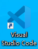
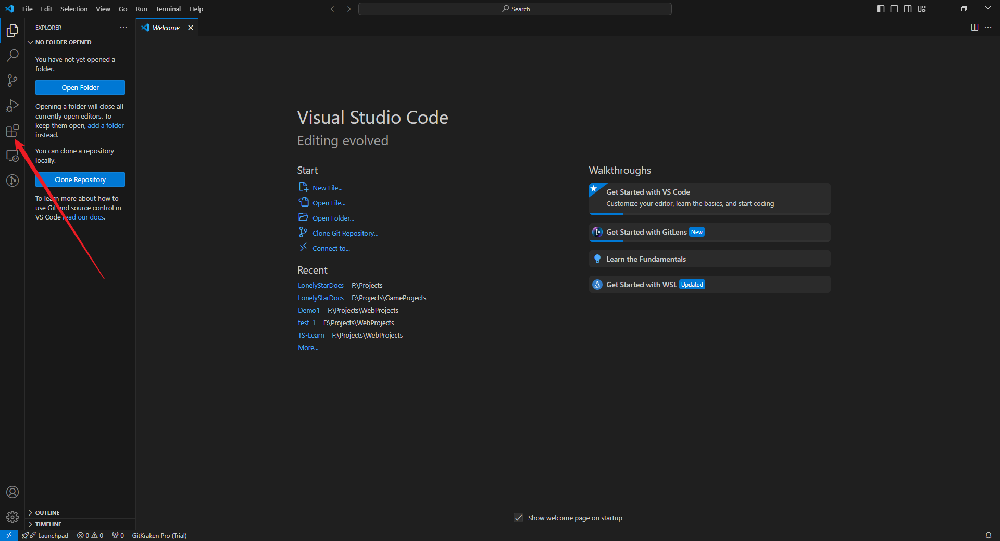
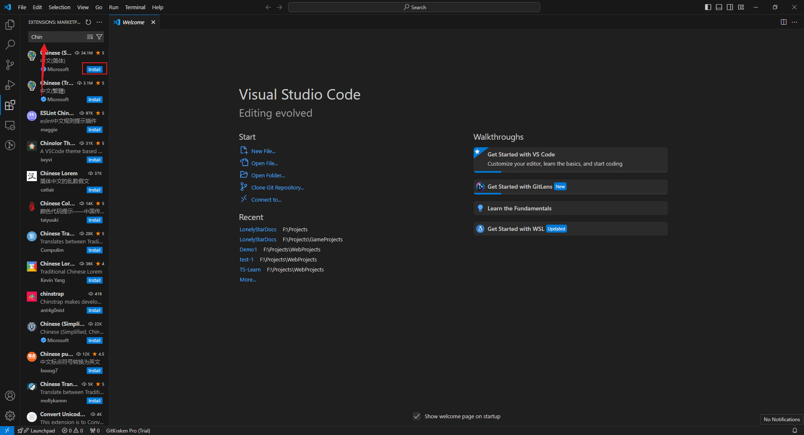
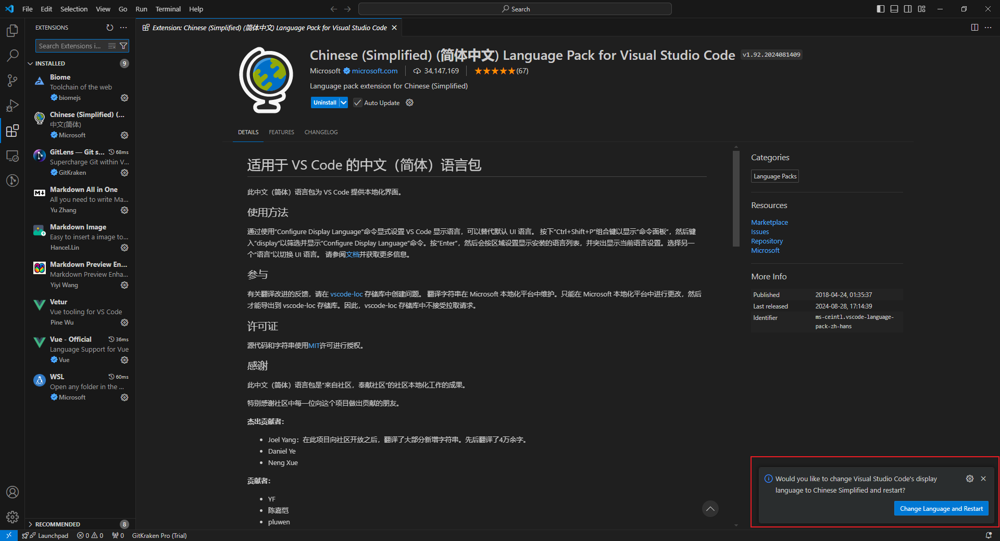

# 准备工作

> [!IMPORTANT]
> 请安装下列应用：
> * [Git](https://git-scm.com/), 必装
> * [Visual Studio Code](https://code.visualstudio.com/)，必装
> * [NodeJs](https://nodejs.org/zh-cn/download/package-manager)，选装

## VS Code插件

点击[Visual Studio Code](https://code.visualstudio.com/)下载安装包并安装完成后，点击图标。

打开后点击下图箭头所指的图标。

在搜索框输入插件名，即可后即可点击`Install`安装。

|插件名|作者|描述|
|-|-|-|
|Chinese (Simplified) (简体中文) Language Pack for Visual Studio Code|Microsoft|VSCode汉化包|
|Vue - Official|Vue|Vue提示插件，需要修改以`.ts`、`mts`、`.js`结尾的文件时建议安装|
|Vetur|Pine Wu|同上|
|GitLens — Git supercharged|GitKraken|必装插件，可以以图表的形式查看分支的具体情况以及快捷的Commit|
|Markdown All in One|Yu Zhang|Markdown编辑插件，包含快捷键、目录等功能|
|Markdown Image|Hancel.Lin|*Markdown编辑插件，非必要，同步文件夹的图片到某个链接*|
|Markdown Preview Enhanced|Yiyi Wang|Markdown编辑插件，为Markdown添加了预览功能|

---
安装完汉化包后，右下角会弹出写着“Change Language and Restart”的蓝色按钮，请点击它。

## NodeJs安装Pnpm