# TweeGo起步

::: details
*Twine 是一个用于讲述互动非线性故事的开源工具。*
*您不需要编写任何代码就可以使用 Twine 创建简单的故事，但当您准备好时，可以通过变量、条件逻辑、图像、CSS 和 JavaScript 来扩展您的故事。*
*Twine 直接发布为 HTML，因此您几乎可以在任何地方发布您的作品。您用它创建的任何内容都可以完全免费使用，包括用于商业目的。*

*摘录至[Twine](https://twinery.org/)*
::: 

[[toc]]

## 为什么要使用TweeGo？

使用Twine的图形化编辑器时，片段的管理变得复杂。我尝试寻找具体储存路径，只在`Documents\Twine\故事`文件夹下找到单个的HTML。

即使尝试使用Twine导出为Twee，也只是单个文件。


而单文件对版本控制来说，是地狱。

想象一下，大家一起写小说，但纸只有一张。于是，不断的争抢好写上自己的内容、需要不停的擦掉别人写好的部分改写为自己的，或者把自己被改写的内容改回去。而拆分文件相当于给每个人分发属于自己的稿纸，让大家可以专注于自己的创作。

同样的事情放在Twine上也是一个道理。多人同时修改同一文件时，可能出现修改回退、文本混乱。这种情况下即使使用了 `GIT` 或 `SVN` 这类[版本控制工具](/开发工具/Git的使用)，也会反复出现需要处理的冲突。

因此使用TweeGo来拆分文件，才能进行更好的团队协作。我们也可以得出另一个结论，如果你没有把片段存储在不同文件的需求，那就完全不需要使用 `TweeGO` 而是直接使用 `Twine` 更为合适些。

下面是来自TweeGo官方文档的介绍。

> [!NOTE]
> Why use Tweego? Tweego lets you write Twine projects using your favorite text editor, rather than the Twine software. You write passages in plain text files using the Twee Notation across as few or as many files as you choose, which can make working, and collaborating, on Twine projects faster and easier. When you're ready to publish or test, you simply compile all your project files into an .html file with Tweego.
> 
> 为什么使用 Tweego？Tweego 让你可以使用自己喜欢的文本编辑器编写 Twine 项目，而不是Twine 软件。你可以使用Twee Notation在任意数量的纯文本文件中编写段落，这可以使在 Twine 项目上的工作和协作变得更快更简单。当你准备好发布或测试时，只需使用 Tweego 将所有项目文件编译成一个.html文件。


## TweeGo 安装及简单使用

> [!IMPORTANT]
> 开始前请下载下列文件，并安装：
> 1. [TweeGo](https://www.motoslave.net/tweego/) 编译工具，可以将多个twee编译为html文件。
> 2. [VsCode](https://code.visualstudio.com/) 轻量级的编辑器，拥有庞大的扩展市场，支持代码补全。
> 3. [SugarCube](https://www.motoslave.net/sugarcube/) Twine的故事格式，本教程基于SugarCube。


下载完后我们会得到三个文件，分别是 `tweego-2.1.1-windows-x64.zip` 、`sugarcube-2.37.3-for-twine-2.1-local.zip` 和 `VSCodeUserSetup-x64-1.92.2.exe` *（于2024年9月5日下载）*。

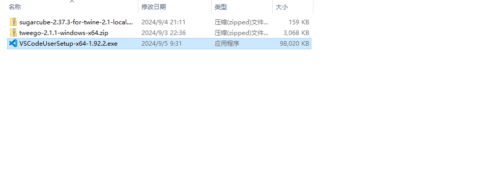

先解压TweeGo的压缩包到任意文件夹，如图所示：

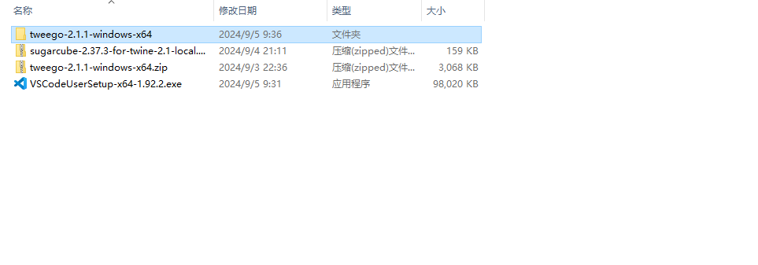

由于TweeGo不自带最新的SugarCube，我们需要点击进入至 `storyformats` 文件夹，在这里解压 `SugarCube`。如果不想覆盖TweeGo自带的其他版本的SugarCube请重命名该文件夹，并且解压后需注意目录层级确保在`storyformats\sugarcube-版本号\` 下就是下面的这些文件。
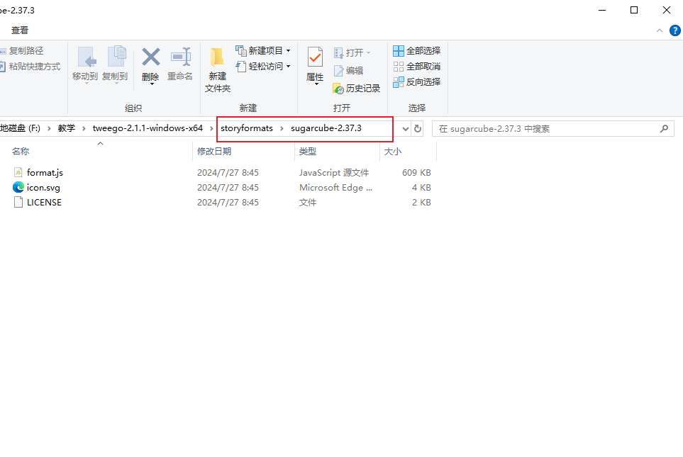

完成上述操作且安装完成Vscode后，点击VsCode图标后打开。在任意位置新建任意名字文件夹，并打开它。之后所有的代码、文本都在放置在该文件夹下。
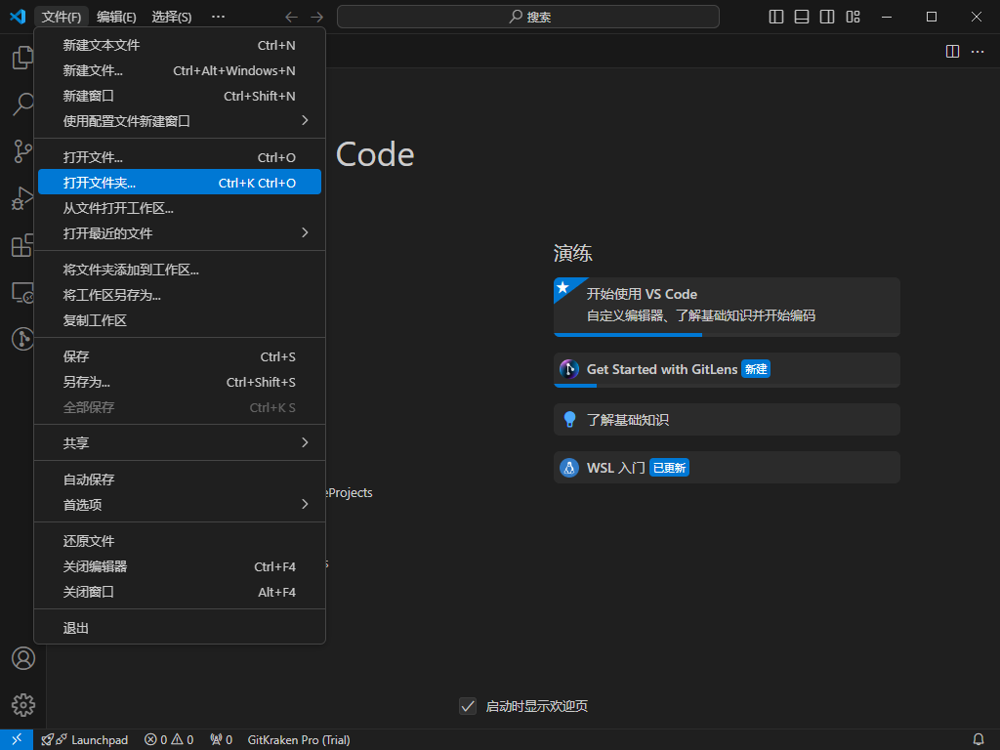

具体需要安装的插件可以参考[准备工作](/开发工具/准备工作.md#vs-code插件)中的VsCode插件部分，一般情况下安装汉化包、`Twee3 Language Tools`、`Live Server` 就够了。安装完后，右键新建以`.twee`为结尾的入口文件，该文件可以是任意名。比如我这边是index.twee，但最好不要是中文，可能会导致奇怪的问题。
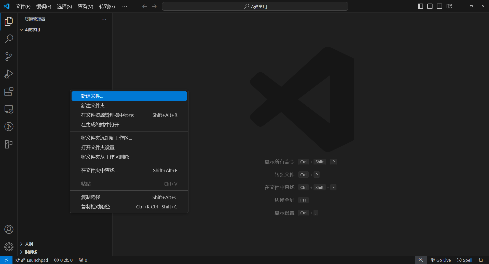

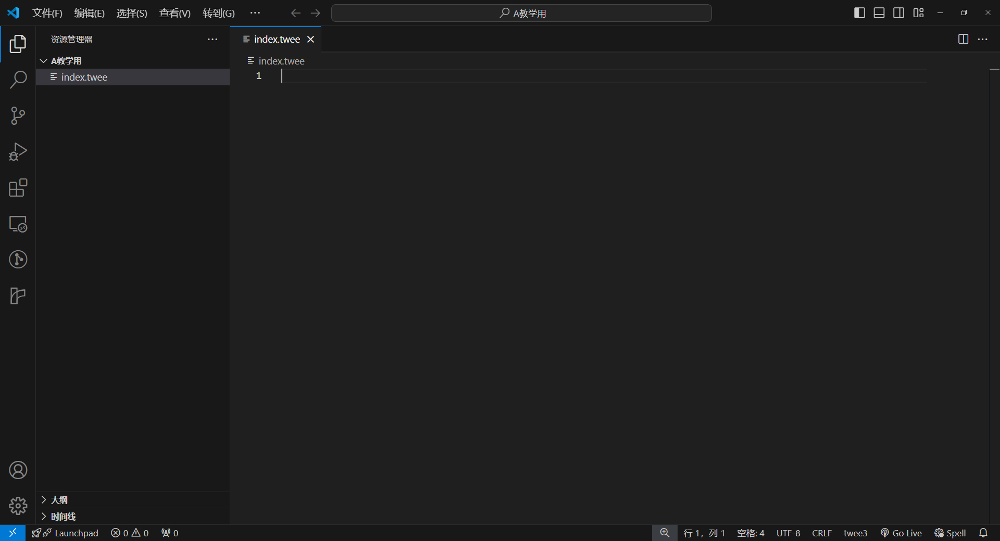

接下来需要设置使用的故事格式以及一些基本数据，如果你安装了Twee3的提示插件，在输入 `s` 后会弹出StoryData的字样，回车就会生成 `StoryData`。
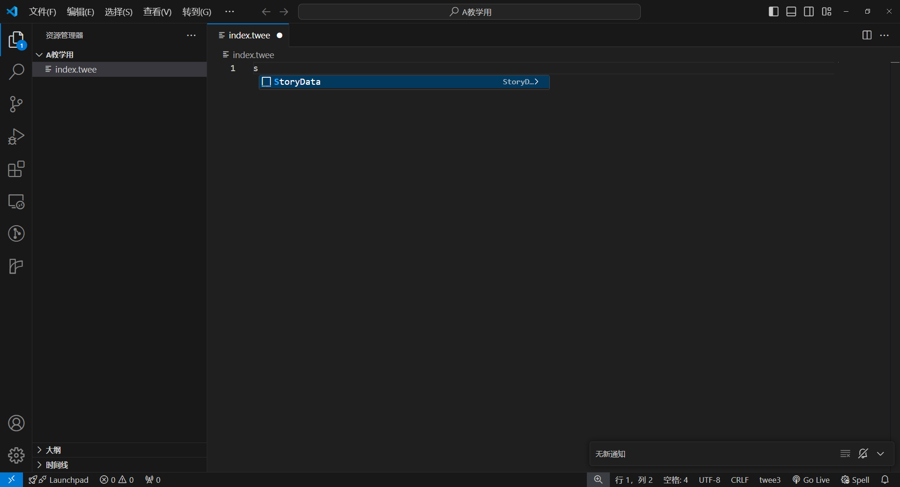

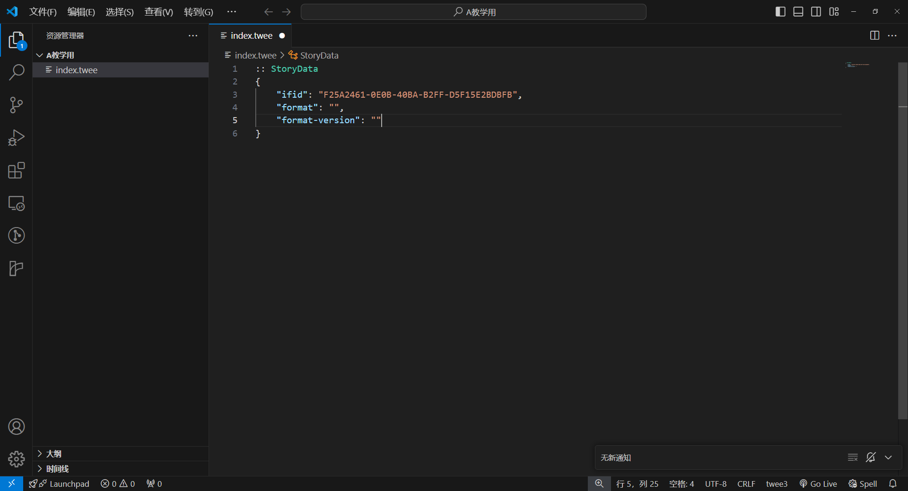

下面是StoryData中的各个属性的值：

* ifid: 标识符，类似书籍的ISBN用于标识项目。
* start: 开始片段的名称，可以用::Start替代。
* format: 具体格式故事格式。
* format-version: 故事格式的版本。

::: details
The StoryData passage may be used to specify basic project settings. Its contents must consist of a JSON chunk, which is, generally, pretty-printed—i.e., line-broken and indented.

The core properties used with all story formats include:

* ifid: (string) Required. The project's Interactive Fiction IDentifier (IFID), which is a unique code used to identify your project—similar to the ISBN code assigned to a book. If the project does not already have an IFID, you may omit the property and Tweego will automatically generate one for you with instructions on how to copy it into the chunk.

* start: (string) Optional. The name of the starting passage. If omitted, defaults to the Start passage.

The properties used only with Twine 2-style story formats include:

* format: (string) Optional. The name of the story format to compile against—e.g., SugarCube, Harlowe, Chapbook, Snowman.
* format-version: (string) Optional. The version of the story format to compile against. Story format versions follow the Semantic Versioning specification, though generally use only the major.minor.patch form—e.g., 2.30.0. From the installed story formats matching the name specified in format, Tweego will attempt to use the greatest version that matches the specified major version—i.e., if format-version is 2.0.0 and you have the versions 1.0.0, 2.0.0, 2.5.0, and 3.0.0 installed, then Tweego will choose 2.5.0.

```
:: StoryData
{
	"ifid": "D674C58C-DEFA-4F70-B7A2-27742230C0FC",
	"format": "SugarCube",
	"format-version": "2.30.0",
	"start": "My Starting Passage"
}
```
*摘录至[TweeGo](https://www.motoslave.net/tweego/docs/#special-passages-storydata)*
::: 

```
:: StoryData
{
    "ifid": "F25A2461-0E0B-40BA-B2FF-D5F15E2BDBFB",
    "format": "SugarCube",
    "format-version": "2.37.3",
    "start": "HelloWorld"
}

:: StoryTitle

Hello World!

:: HelloWorld
Hello World!
```

随后右键资源管理器，点击集成终端打开在[命令行](前置知识#windows10-如何打开命令行)输入`tweego.exe -o index.html .\index.twee` 就能导出html到index.html这个文件中。如果没有设置环境变量，请百度环境变量如何添加或者使用完整路径，例如：`F:\教学\tweego-2.1.1-windows-x64\tweego.exe -o index.html .\index.twee`。输入完后回车就能看见index.html。

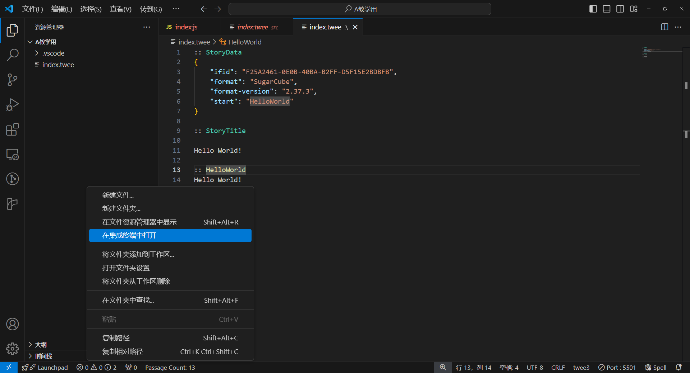

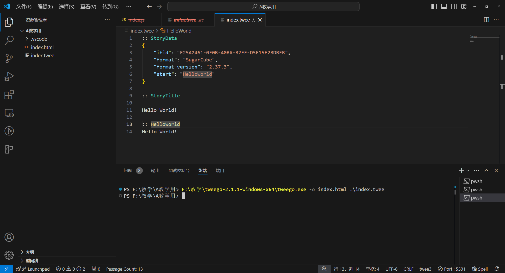

具体tweego的具体指令请参考官方文档，这里只做简要说明：
```bash
tweego -o 文件名 需要编译的文件(夹)1 需要编译的文件(夹)2 ...
```

::: details
Compile example_1.twee as example_1.html with the default story format:
将 example_1.twee 编译为 example_1.html ，使用默认故事格式：
```bash
tweego -o example_1.html example_1.twee
```
Compile all files in example_directory_2 as example_2.html with the default story format:
将 example_directory_2 中的所有文件编译为 example_2.html ，使用默认故事格式：
```bash
tweego -o example_2.html example_directory_2
```
Compile example_3.twee as example_3.html with the story format snowman:
编译 example_3.twee 为 example_3.html ，故事格式为 snowman ：
```bash
tweego -f snowman -o example_3.html example_3.twee
```
:::

另外，如果如果拆分成多个文件使用，可以下载项目仓库里的示例，或者在 [Release](https://github.com/Raven-Book/twee-example/archive/refs/heads/master.zip)下载 `example-1.zip` 。

解压后用vscode打开，在终端使用 `tweego.exe -o index.html .\js\ .\src\` 即可编译为index.html。

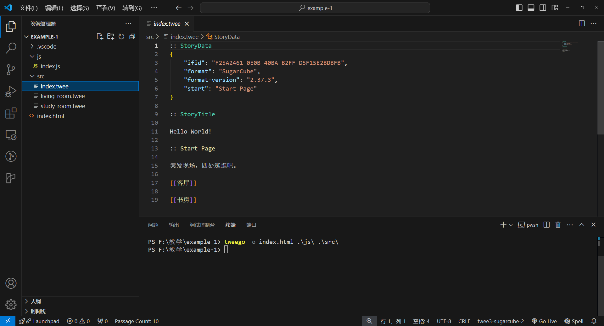


## Git、Github与Github Pages

> [!IMPORTANT]
> 开始前请执行下列操作：
> 1. 安装[Git](https://git-scm.com/)工具
> 2. 注册[Github](https://github.com/)账号
> 3. (可选) VsCode安装GitLens插件

Git是版本控制系统，本质是记录文件的修改（包括删除、新增、创建），且可以查看或回退到某一次修改。

其中有四个重要概念：

1. 工作区
   假设有一个需要处理事件，桌子上摆着与事件相关的文件，你可以随意的修改、调整或者新增与事件有关文件。而摆着这些文件的桌子，就是工作区。
2. 暂存区
   整理完办公桌上的材料，从中找出需要归档的部分，在还未存入档案柜时临时放置的地方就是暂存区。
3. 本地仓库
   独立办公室里的档案柜，存储了已归档的内容，但是别人只有到你的办公室里（使用你的电脑）才能查看。
4. 远程仓库
   公共档案室，所有人都能访问，你可以将档案柜里的内容存入档案室。同样的，别人也行，因此大家可以基于此团队协作。

在理解上述四个概念后，我们再来看Git的三种状态就不难理解了。

* 已暂存（staged），表示对一个已修改文件的当前版本做了标记，使之包含在下次提交的快照中。
* 已修改（modified），表示修改了文件，但还没保存到数据库中。
* 已提交（committed），表示数据已经安全地保存在本地数据库中。

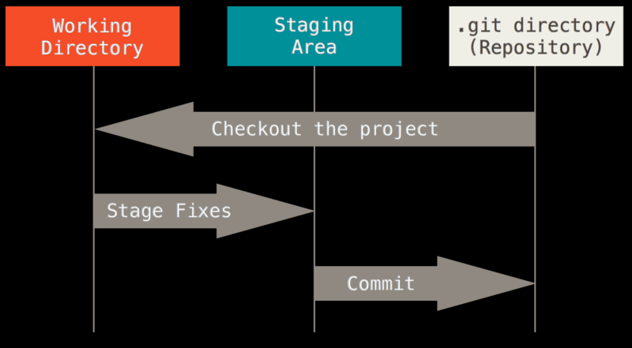

理解完这三种状态，且保证理解了[命令行](前置知识#windows10-如何打开命令行)是什么后，就可以打开命令行初始化Git。Git需要初始化的内容有两个，一是邮箱，二是昵称，它们的作用是标识谁提交了什么到仓库里。因此最好与注册GitHub使用的邮箱和用户名一致。

```bash
git config --global user.name "John Doe"
git config --global user.email "johndoe@example.com"
```

随后新建或者打开指定目录，随后在该目录下执行命令 `git init .`。 

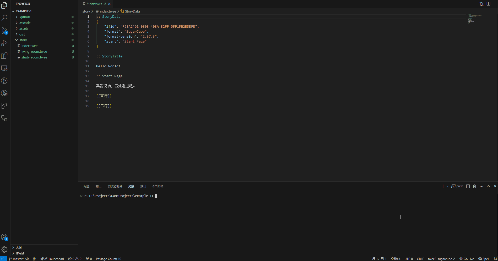

在初始化本地仓库后，且在目录中做过更新（如新建文件），就可以将目录中需要提交的内容存储至暂存区。

```bash
git add . # 添加所有文件到缓冲区
```

再确认没有其他需要更改的内容时，输入`git commit`指令。

```bash
git commit -m "提交消息，用于标识修改内容"
```

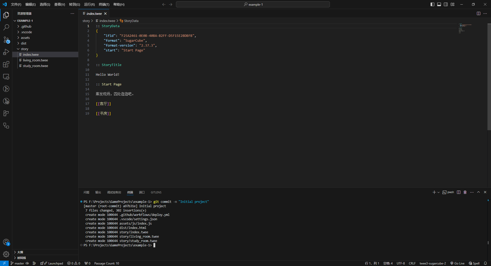

当然如果你安装了`Git Lens`，可以使用更为直观的方式将文件存入暂存区，再提交。

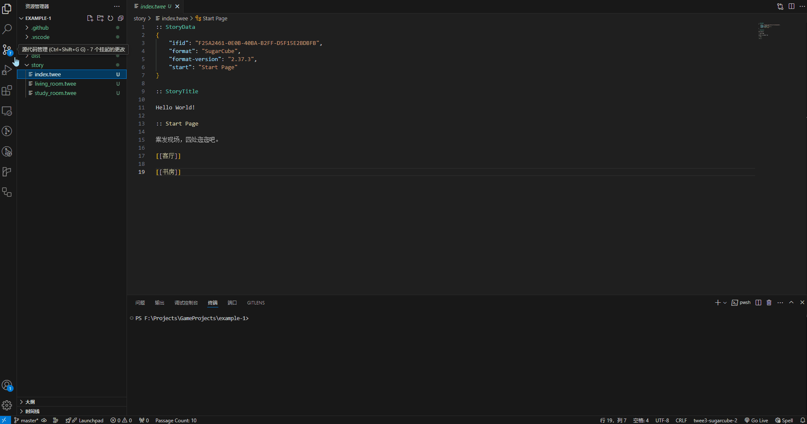

接下要将内容推送至远程仓库，我们使用Github托管我们的代码，因此请确保账号已经注册。

打开[新建](https://github.com/new)，输入项目名、项目描述后点击 `Create repository` 创建仓库。

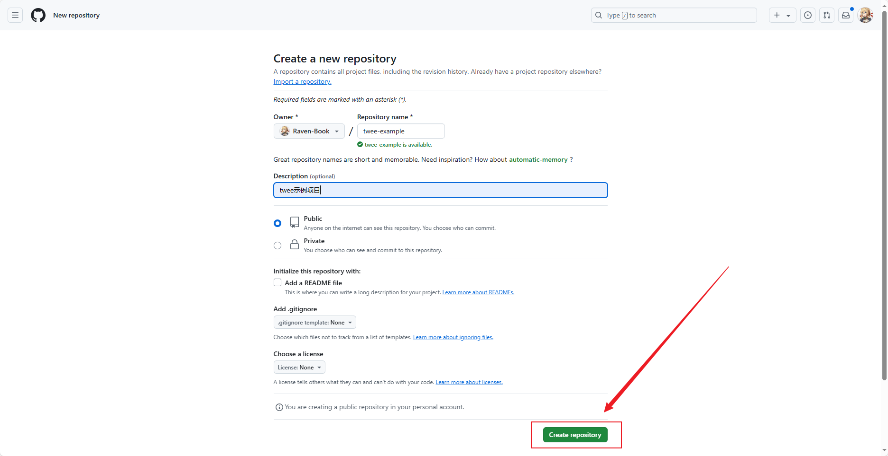

再命令行输入这一行命令，来为本地仓库指定远程仓库的地址，之后将指定分支推送到 Github 上。Github默认的主分支名为 `main` , git默认的是 `master` 。

```
git remote add origin https://具体的仓库地址
```

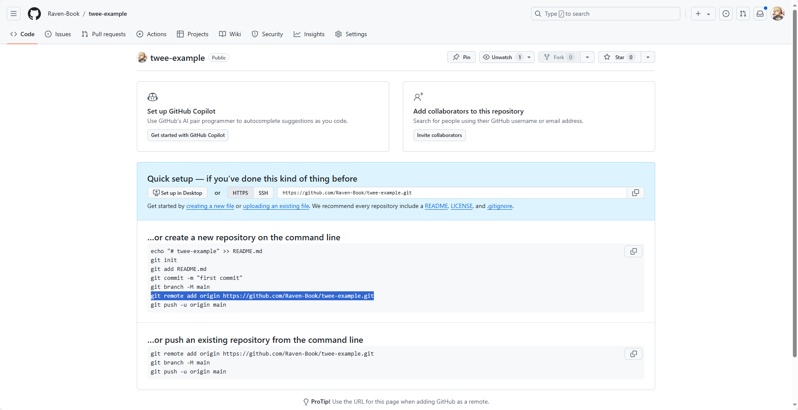

```powershell
PS F:\Projects\GameProjects\example-1> git remote add origin https://github.com/Raven-Book/twee-example.git
PS F:\Projects\GameProjects\example-1> git push --set-upstream origin master 
Enumerating objects: 16, done.
Counting objects: 100% (16/16), done.   
Delta compression using up to 12 threads
Compressing objects: 100% (10/10), done.
Writing objects: 100% (16/16), 162.97 KiB | 7.08 MiB/s, done. 
Total 16 (delta 0), reused 0 (delta 0), pack-reused 0 (from 0)
To https://github.com/Raven-Book/twee-example.git
 * [new branch]      master -> master
branch 'master' set up to track 'origin/master'. 
 ```

 仅首次提交需要指定远程仓库的地址，后续提交直接输入 `git push`，或者在Git Lens里点击按钮推送到远程仓库。可以自己新建些项目，练练手。

 需要注意的是 `Git` 在多人协作的情况下，在每次推送至远程仓库前，需要输入 `git pull` 来拉取其他的修改的内容，在 `git push` 推送你的修改。若非特殊情况，不要使用 `--force` 强制提交你的内容，可能会导致进度丢失。


### 部署Github Pages

// TODO 施工中

### 自动化部署GitHub Pages
> [!IMPORTANT] 
> [Github Docs](https://docs.github.com/zh/pages/getting-started-with-github-pages) 对 Github Pages的介绍： 
> GitHub Pages 是一项静态站点托管服务，它直接从 GitHub 上的仓库获取 HTML、CSS 和 JavaScript 文件，（可选）通过构建过程运行文件，然后发布网站。 可以在 GitHub Pages 示例集合中看到 GitHub Pages 站点的示例。

请打开你的Github远程仓库地址，点击 `1 Branch`，点击 `New brach` 按钮新建分支，输入`gh-pages`。再点击 `Create new branch` 创建分支。

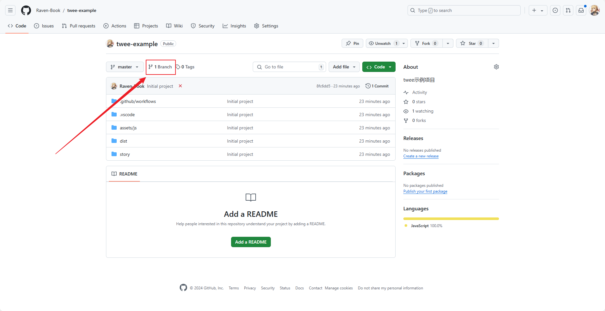

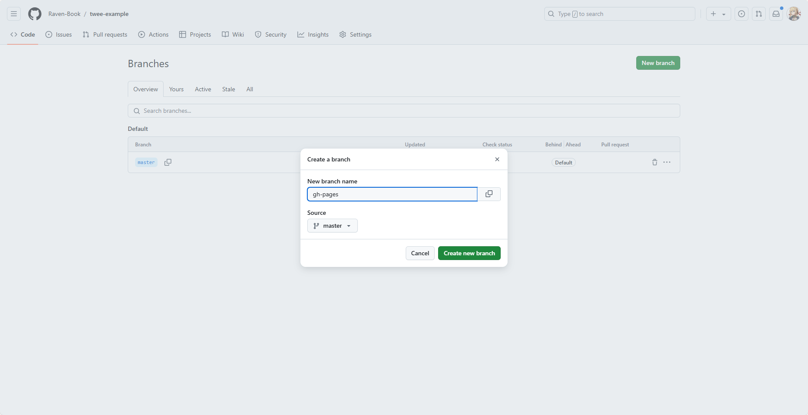

完整后接着设置 Github Pages，点击 `Settings` 后点击 `Pages`。

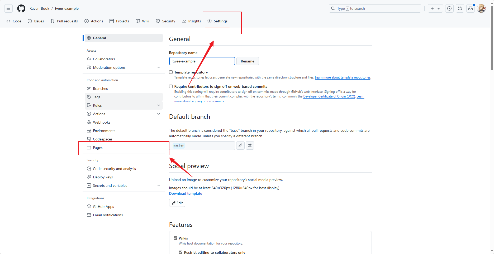

设置 Source 选择 `Deploy from a branch`，`branch` 选择 `gh-pages` 设置完后我们进行下一步。

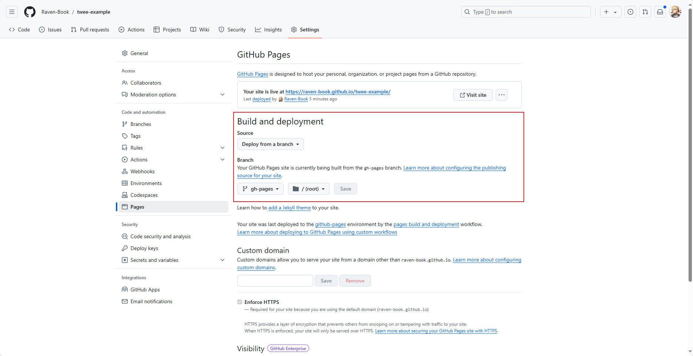

点击 `Actions` 的 `General` 将 Workflow 的 permission 修改支持读写，然后点击Save保存。

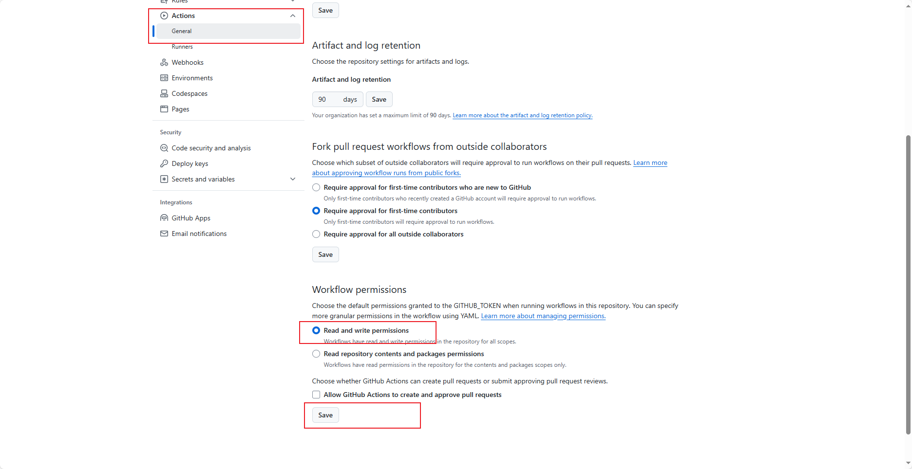

由于TweeGo最后的版本于2020年提交，且多次尝试后依旧无法编译成功。由于本人对Go语言并不熟悉，所以这里采用了比较简单的方式。先去[tweego仓库](https://github.com/tmedwards/tweego/releases/tag/v2.1.1)下载 `tweego-2.1.1-linux-x64.zip` 。

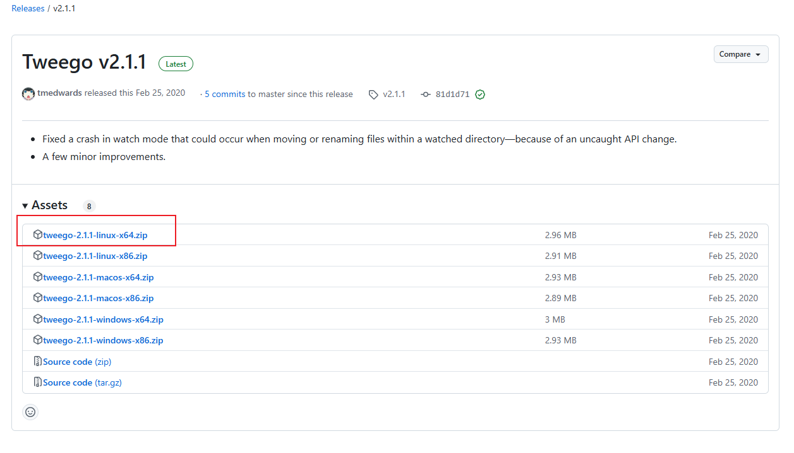

解压后并按照上文添加最新SugarCube的方式在 `storyformats` 下添加你需要的故事格式，比如我这边是 `sugarcube-2.37.3`，确保目录层级正确后在`tweego-2.1.1-linux-x64` 页面创建zip压缩包。

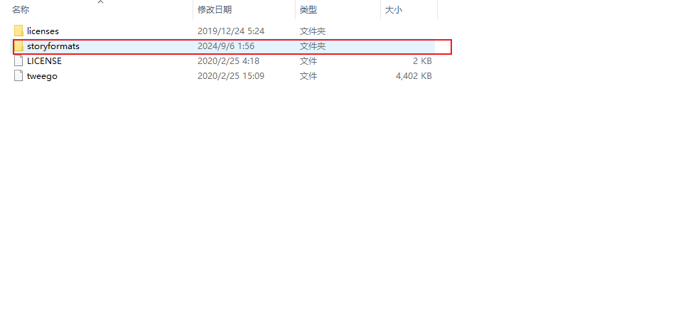

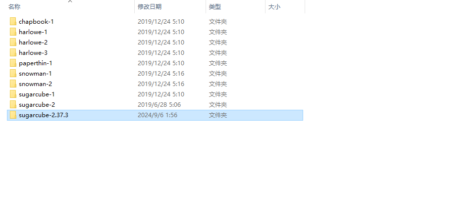

压缩包的目录层级如下：

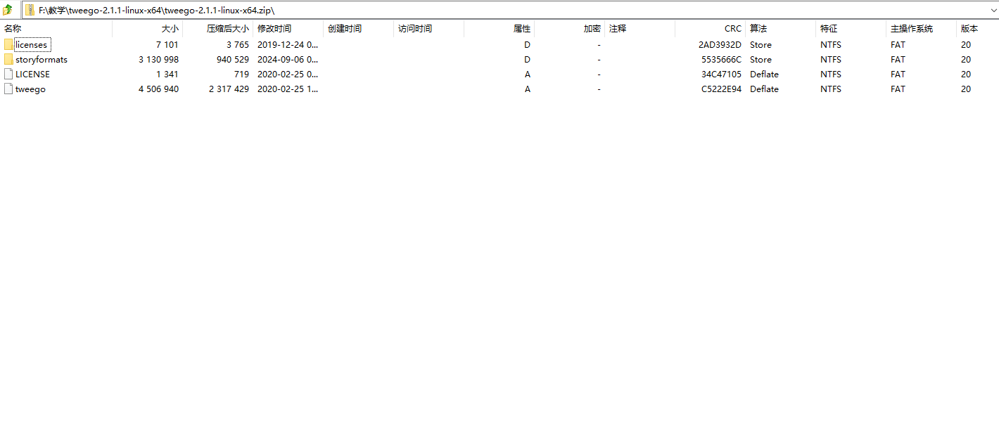

回到你的远程仓库地址，点击Create a new release，将压缩包上传后点击 `Publish release` 。

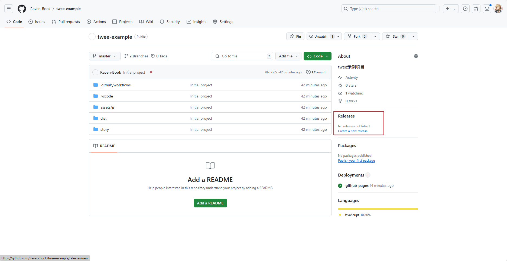

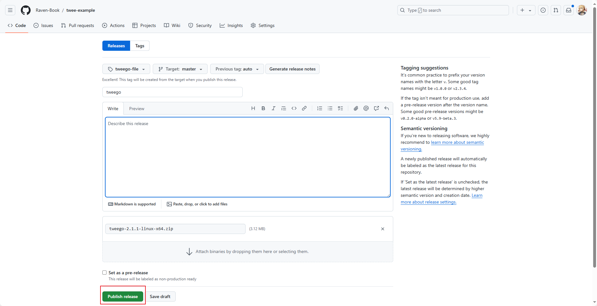

右键复制链接，这个链接后续能用到。

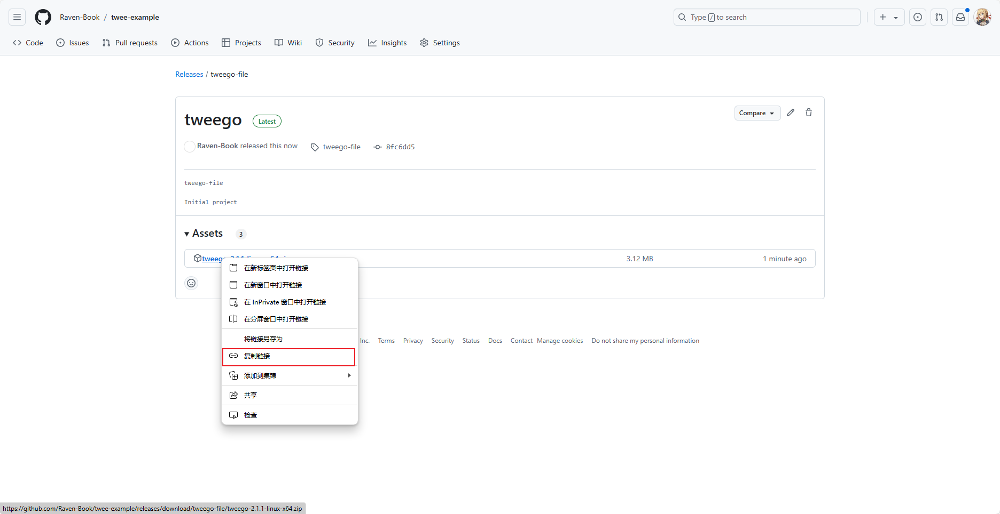

在你的项目中新建 `.github`，在该目录下创建 `workflows` 在创建 `deploy.yml`

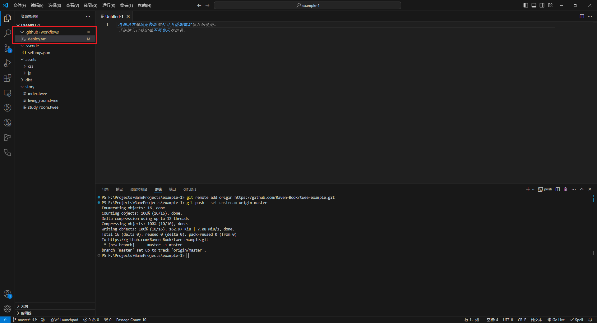

创建完后将下面内容复制到你的 `deploy.yml` 中，将其中的 `具体的下载地址` 替换为你刚刚复制到的内容，保存后按照上面的流程，存入暂存区 → 提交到本地仓库 → 推送至远程仓库。

```yml
name: deploy game to Pages

on:
  push:
    branches: [master]

  workflow_dispatch:

jobs:
  build:
    runs-on: ubuntu-latest
    steps:
      # 允许后续代码读写仓库
      - uses: actions/checkout@v3
        with:
          submodules: true  # Fetch Hugo themes (true OR recursive)
          fetch-depth: 0    # Fetch all history for .GitInfo and .Lastmod- uses: actions/checkout@v4
      - name: download tweego
        run: |
          mkdir tools
          curl -L -o tools/tweego.zip 具体的下载地址
          unzip tools/tweego.zip -d tools/
      
      - name: set execute permissions
        run: chmod +x tools/tweego

      - name: add tweego to PATH
        run: echo "${{ github.workspace }}/tools" >> $GITHUB_PATH
      # 请根据需要替换./assets、./story
      - name: build game 
        run: tweego ./assets ./story -o dist/index.html

      - name: deploy to github pages
        uses: peaceiris/actions-gh-pages@v4
        with:
          github_token: ${{ secrets.GITHUB_TOKEN }}
          publish_dir: ./dist
```

如果成功，`pages` 这儿会有你的链接，可以点击这里的齿轮将路径替换为 `pages` 的页面上的具体路径。

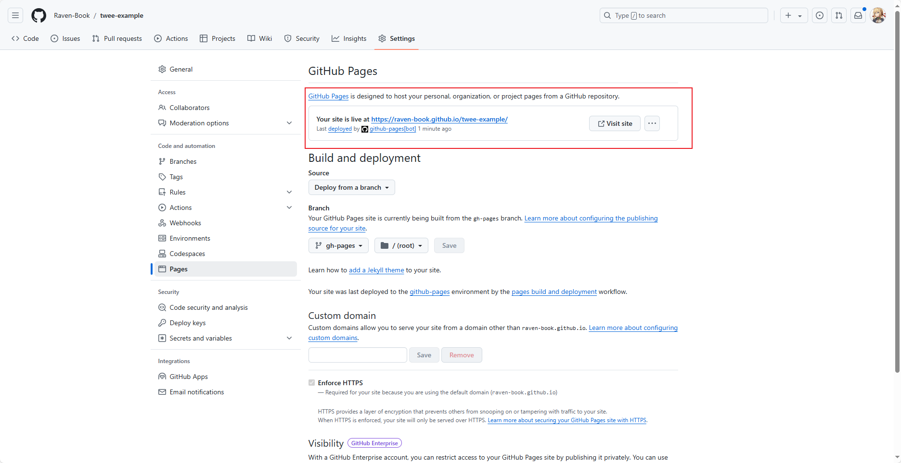
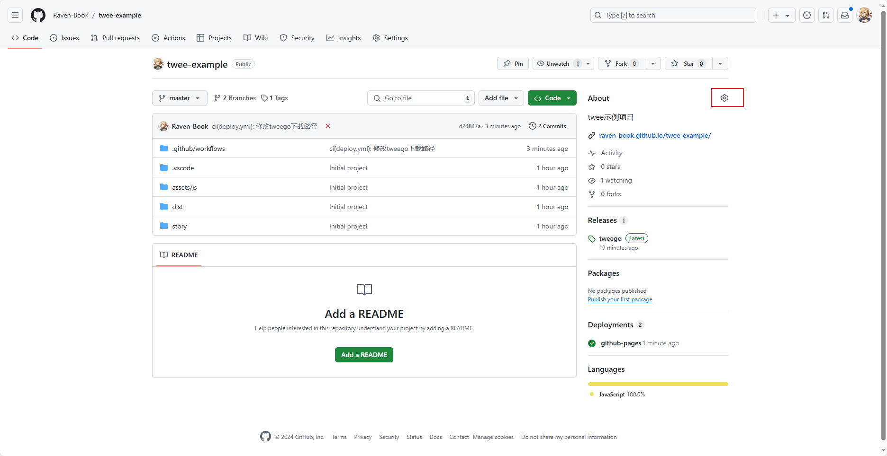
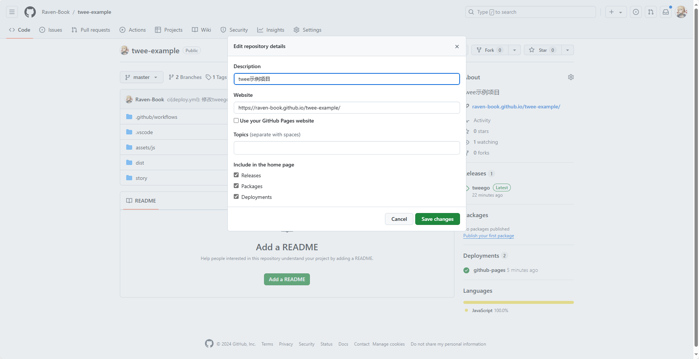

现在，如果后续项目发生变动（即提交到远程仓库），Github Pages 会自动更新页面。点击https://github.com/Raven-Book/twee-example 就能看见示例项目。

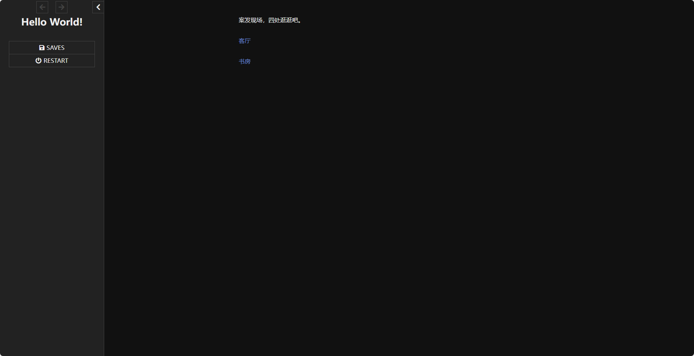

关于其他的Git操作，请移步[Git的使用](/开发工具/Git的使用)。