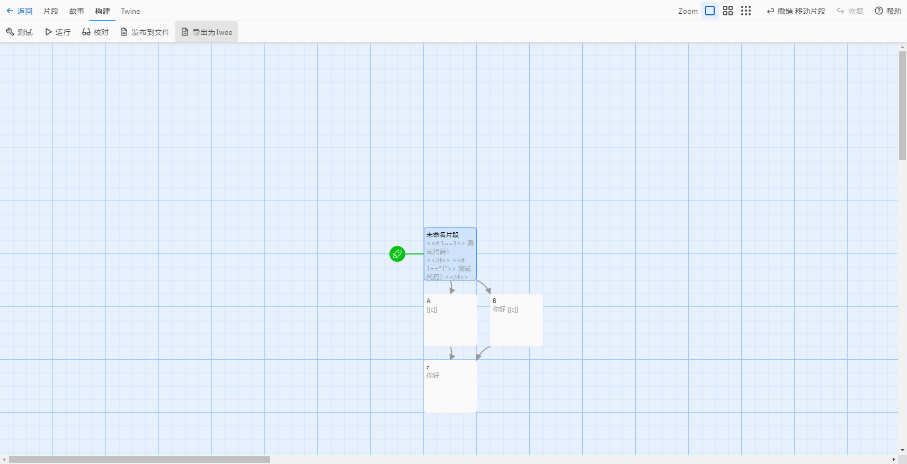

# TweeGo起步

::: details
*Twine 是一个用于讲述互动非线性故事的开源工具。*
*您不需要编写任何代码就可以使用 Twine 创建简单的故事，但当您准备好时，可以通过变量、条件逻辑、图像、CSS 和 JavaScript 来扩展您的故事。*
*Twine 直接发布为 HTML，因此您几乎可以在任何地方发布您的作品。您用它创建的任何内容都可以完全免费使用，包括用于商业目的。*

*摘录至[Twine](https://twinery.org/)*
::: 

## 为什么要使用TweeGo？

使用Twine的图形化编辑器时，片段的管理变得复杂。我尝试寻找具体储存路径，只在`Documents\Twine\故事`文件夹下找到单个的HTML。

即使尝试使用Twine导出为Twee，也只是单个文件。

而单文件对版本控制来说，是地狱。

想象一下，大家一起写小说，但纸只有一张。于是，不断的争抢好写上自己的内容、需要不停的擦掉别人写好的部分改写为自己的，或者把自己被改写的内容改回去。而拆分文件相当于给每个人分发属于自己的稿纸，让大家可以专注于自己的创作。

同样的事情放在Twine上也是一个道理。多人同时修改同一文件时，可能出现修改回退、文本混乱。这种情况下即使使用了 `GIT` 或 `SVN` 这类[版本控制工具](/开发工具/Git的使用)，也会反复出现需要处理的冲突。

因此，使用TweeGo来拆分文件，才能进行很好的团队协作。

下面是来自TweeGo官方文档的介绍。

> [!NOTE]
> Why use Tweego? Tweego lets you write Twine projects using your favorite text editor, rather than the Twine software. You write passages in plain text files using the Twee Notation across as few or as many files as you choose, which can make working, and collaborating, on Twine projects faster and easier. When you're ready to publish or test, you simply compile all your project files into an .html file with Tweego.
> 
> 为什么使用 Tweego？Tweego 让你可以使用自己喜欢的文本编辑器编写 Twine 项目，而不是Twine 软件。你可以使用Twee Notation在任意数量的纯文本文件中编写段落，这可以使在 Twine 项目上的工作和协作变得更快更简单。当你准备好发布或测试时，只需使用 Tweego 将所有项目文件编译成一个.html文件。