# TweeGo起步

::: details
*Twine 是一个用于讲述互动非线性故事的开源工具。*
*您不需要编写任何代码就可以使用 Twine 创建简单的故事，但当您准备好时，可以通过变量、条件逻辑、图像、CSS 和 JavaScript 来扩展您的故事。*
*Twine 直接发布为 HTML，因此您几乎可以在任何地方发布您的作品。您用它创建的任何内容都可以完全免费使用，包括用于商业目的。*

*摘录至[Twine](https://twinery.org/)*
::: 

## 为什么要使用TweeGo？

使用Twine的图形化编辑器时，片段的管理变得复杂。我尝试寻找具体储存路径，只在`Documents\Twine\故事`文件夹下找到单个的HTML。

即使尝试使用Twine导出为Twee，也只是单个文件。

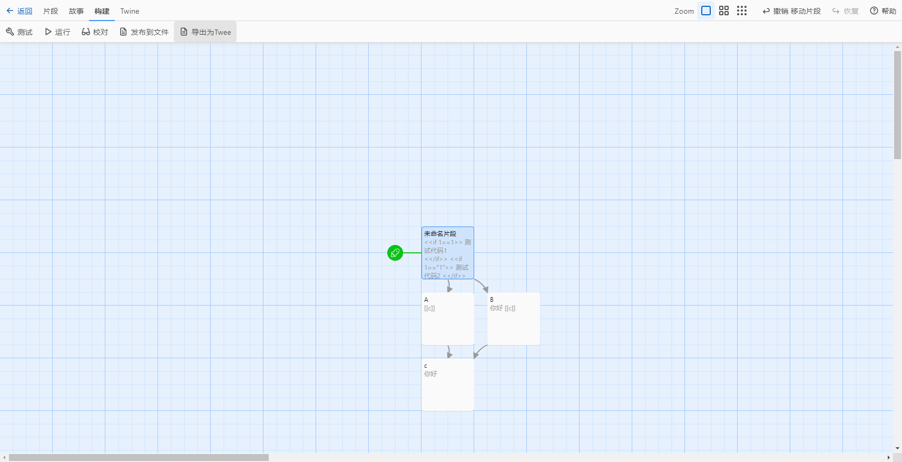

而单文件对版本控制来说，是地狱。

想象一下，大家一起写小说，但纸只有一张。于是，不断的争抢好写上自己的内容、需要不停的擦掉别人写好的部分改写为自己的，或者把自己被改写的内容改回去。而拆分文件相当于给每个人分发属于自己的稿纸，让大家可以专注于自己的创作。

同样的事情放在Twine上也是一个道理。多人同时修改同一文件时，可能出现修改回退、文本混乱。这种情况下即使使用了 `GIT` 或 `SVN` 这类[版本控制工具](/开发工具/Git的使用)，也会反复出现需要处理的冲突。

因此使用TweeGo来拆分文件，才能进行更好的团队协作。我们也可以得出另一个结论，如果你没有把片段存储在不同文件的需求，那就完全不需要使用 `TweeGO` 而是直接使用 `Twine` 更为合适些。

下面是来自TweeGo官方文档的介绍。

> [!NOTE]
> Why use Tweego? Tweego lets you write Twine projects using your favorite text editor, rather than the Twine software. You write passages in plain text files using the Twee Notation across as few or as many files as you choose, which can make working, and collaborating, on Twine projects faster and easier. When you're ready to publish or test, you simply compile all your project files into an .html file with Tweego.
> 
> 为什么使用 Tweego？Tweego 让你可以使用自己喜欢的文本编辑器编写 Twine 项目，而不是Twine 软件。你可以使用Twee Notation在任意数量的纯文本文件中编写段落，这可以使在 Twine 项目上的工作和协作变得更快更简单。当你准备好发布或测试时，只需使用 Tweego 将所有项目文件编译成一个.html文件。


## TweeGo 安装及简单使用

> [!IMPORTANT]
> 开始前请下载下列文件，并安装：
> 1. [TweeGo](https://www.motoslave.net/tweego/)
> 2. [SugarCube](https://www.motoslave.net/sugarcube/)
> 3. [VsCode](https://code.visualstudio.com/)

下载完后我们会得到三个文件，分别是 `tweego-2.1.1-windows-x64.zip` 、`sugarcube-2.37.3-for-twine-2.1-local.zip` 和 `VSCodeUserSetup-x64-1.92.2.exe` *（于2024年9月5日下载）*。

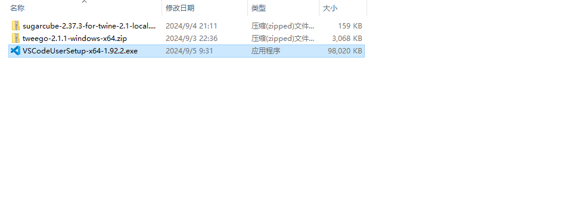

先解压TweeGo的压缩包到任意文件夹，如图所示：

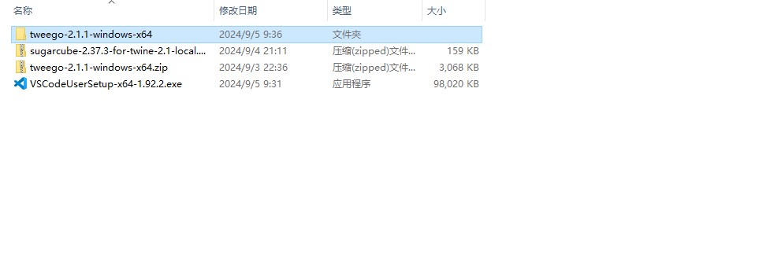

由TweeGo不自带最新的方糖，我们需要点击进入至 `storyformats` 文件夹，在这里解压 `SugarCube`。如果不想覆盖TweeGo自带的其他版本的SugarCube请重命名该文件夹，并且解压后需注意目录层级确保在`storyformats\sugarcube-版本号\` 下就是下面的这些文件。
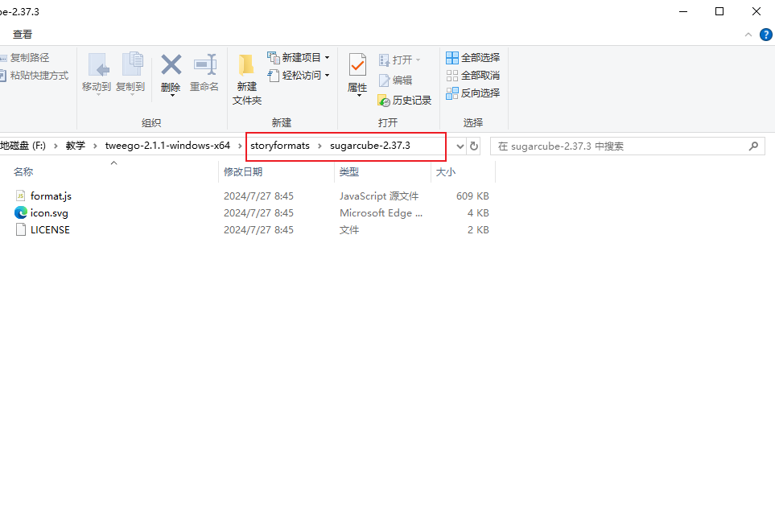

完成上述操作且安装完成Vscode后，点击VsCode图标后打开，打开指定文件夹(工作目录)，之后所有的代码、文本都在放置在该文件夹下。
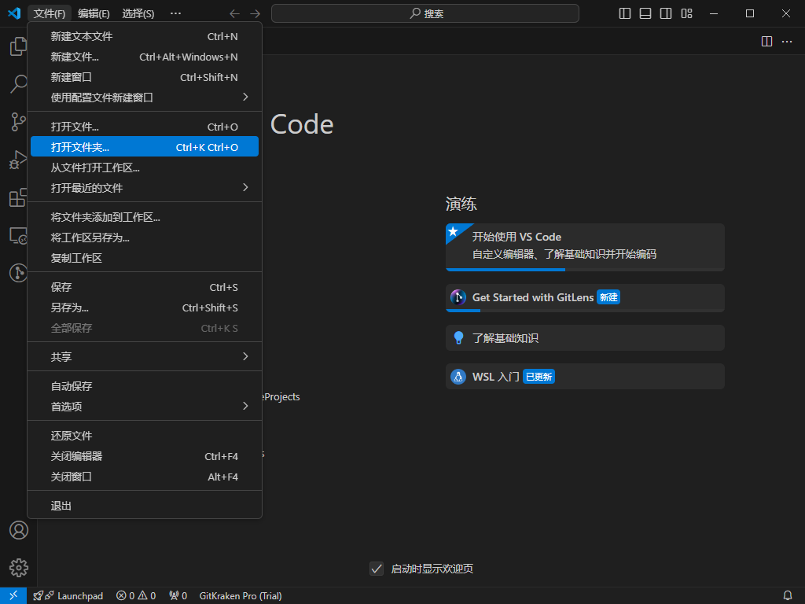

具体需要安装的插件可以参考[准备工作](/开发工具/准备工作.md#vs-code插件)中的VsCode插件部分，一般情况下安装汉化包、`Twee3 Language Tools`、`Live Server` 就够了。安装完后，右键新建以`.twee`为结尾的入口文件，该文件可以是任意的名字。比如我这边是index.twee。
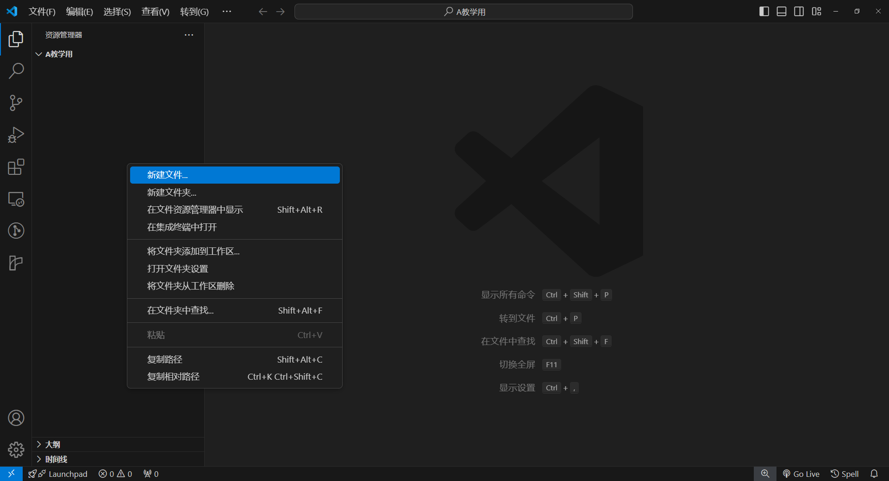

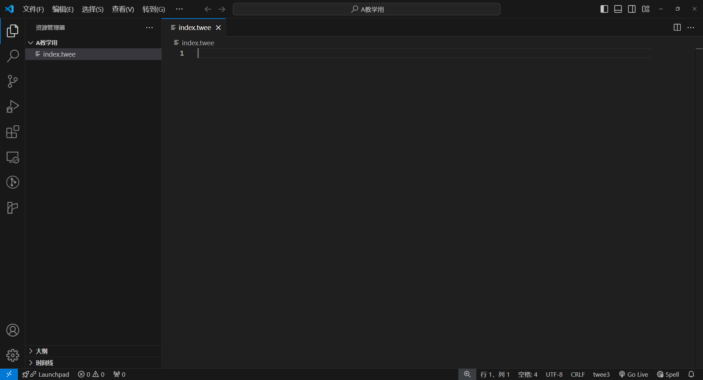

接下来需要设置使用的故事格式以及一些基本数据，如果你安装了Twee3的提示插件，在输入 `s` 后会弹出StoryData的字样，回车就会生成 `StoryData`。
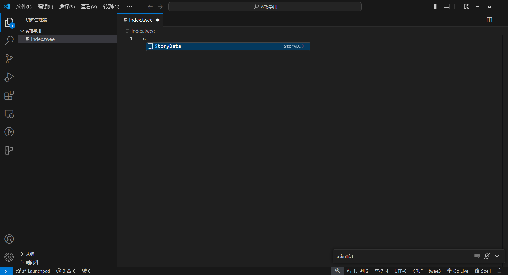

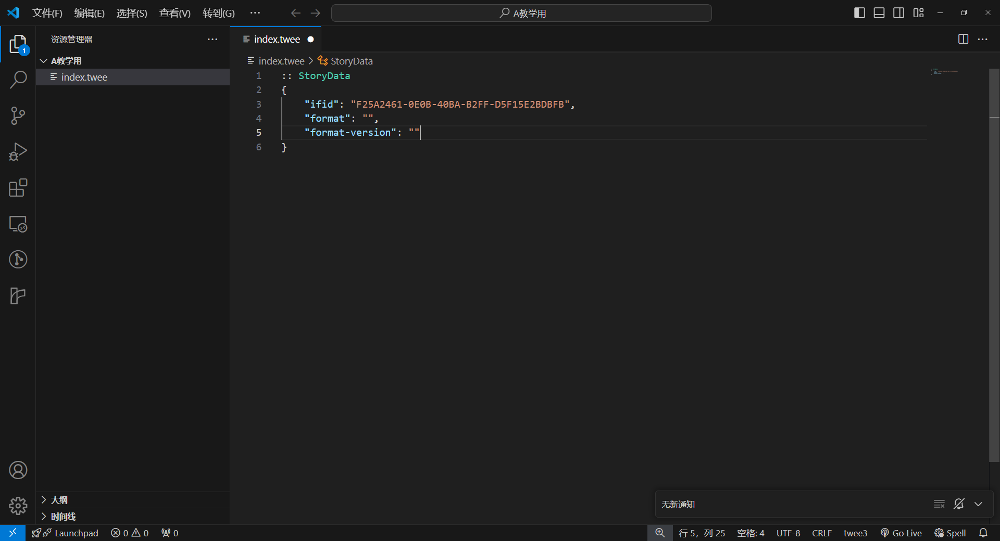

下面是StoryData中的各个属性的值：

* ifid: 标识符，类似书籍的ISBN用于标识项目。
* start: 开始片段的名称，可以用::Start替代。
* format: 具体格式故事格式。
* format-version: 故事格式的版本。

::: details
The StoryData passage may be used to specify basic project settings. Its contents must consist of a JSON chunk, which is, generally, pretty-printed—i.e., line-broken and indented.

The core properties used with all story formats include:

* ifid: (string) Required. The project's Interactive Fiction IDentifier (IFID), which is a unique code used to identify your project—similar to the ISBN code assigned to a book. If the project does not already have an IFID, you may omit the property and Tweego will automatically generate one for you with instructions on how to copy it into the chunk.

* start: (string) Optional. The name of the starting passage. If omitted, defaults to the Start passage.

The properties used only with Twine 2-style story formats include:

* format: (string) Optional. The name of the story format to compile against—e.g., SugarCube, Harlowe, Chapbook, Snowman.
* format-version: (string) Optional. The version of the story format to compile against. Story format versions follow the Semantic Versioning specification, though generally use only the major.minor.patch form—e.g., 2.30.0. From the installed story formats matching the name specified in format, Tweego will attempt to use the greatest version that matches the specified major version—i.e., if format-version is 2.0.0 and you have the versions 1.0.0, 2.0.0, 2.5.0, and 3.0.0 installed, then Tweego will choose 2.5.0.

```
:: StoryData
{
	"ifid": "D674C58C-DEFA-4F70-B7A2-27742230C0FC",
	"format": "SugarCube",
	"format-version": "2.30.0",
	"start": "My Starting Passage"
}
```
*摘录至[TweeGo](https://www.motoslave.net/tweego/docs/#special-passages-storydata)*
::: 

```
:: StoryData
{
    "ifid": "F25A2461-0E0B-40BA-B2FF-D5F15E2BDBFB",
    "format": "SugarCube",
    "format-version": "2.37.3",
    "start": "HelloWorld"
}

:: StoryTitle

Hello World!

:: HelloWorld
Hello World!
```

随后右键资源管理器，点击集成终端打开在命令行输入`tweego.exe -o index.html .\index.twee` 就能导出html到index.html这个文件中。如果没有设置环境变量，请百度环境变量如何添加或者使用完整路径，例如：`F:\教学\tweego-2.1.1-windows-x64\tweego.exe -o index.html .\index.twee`。输入完后回车就能看见index.html。

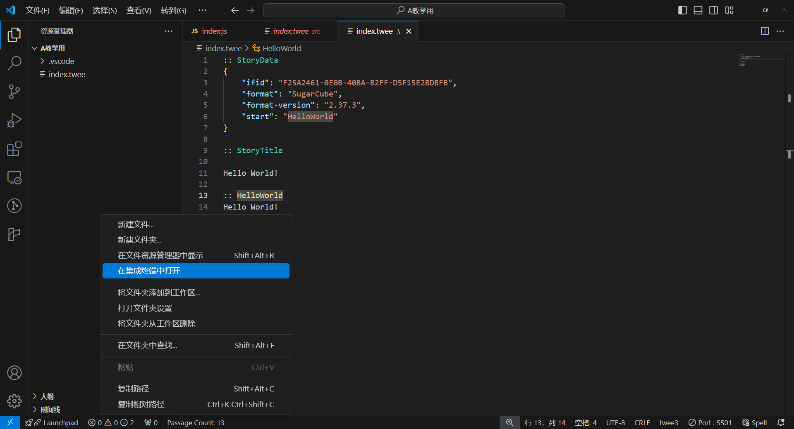

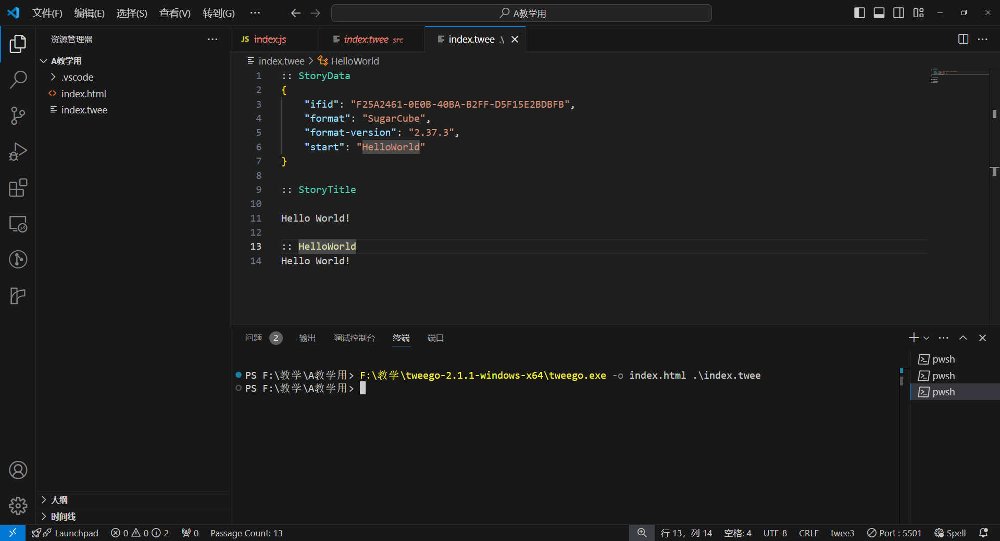

具体tweego的具体指令请参考官方文档，这里只做简要说明：
```bash
tweego -o 文件名 需要编译的文件(夹)1 需要编译的文件(夹)2 ...
```

::: details
Compile example_1.twee as example_1.html with the default story format:
将 example_1.twee 编译为 example_1.html ，使用默认故事格式：
```bash
tweego -o example_1.html example_1.twee
```
Compile all files in example_directory_2 as example_2.html with the default story format:
将 example_directory_2 中的所有文件编译为 example_2.html ，使用默认故事格式：
```bash
tweego -o example_2.html example_directory_2
```
Compile example_3.twee as example_3.html with the story format snowman:
编译 example_3.twee 为 example_3.html ，故事格式为 snowman ：
```bash
tweego -f snowman -o example_3.html example_3.twee
```
:::

另外，如果如果拆分成多个文件使用，可以下载项目仓库里的 `examples\example-1`，或者在 [Release](https://github.com/Raven-Book/TweeGoGuide/releases/download/V0.1.0/example-1.zip)下载 `example-1.zip` 。

解压后用vscode打开，在终端使用 `tweego.exe -o index.html .\js\ .\src\` 即可编译为index.html。

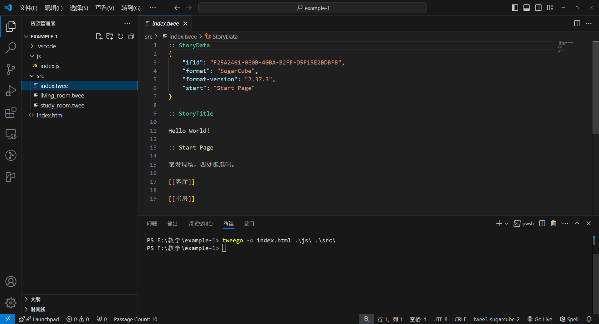


## Git版本控制

// TODO
