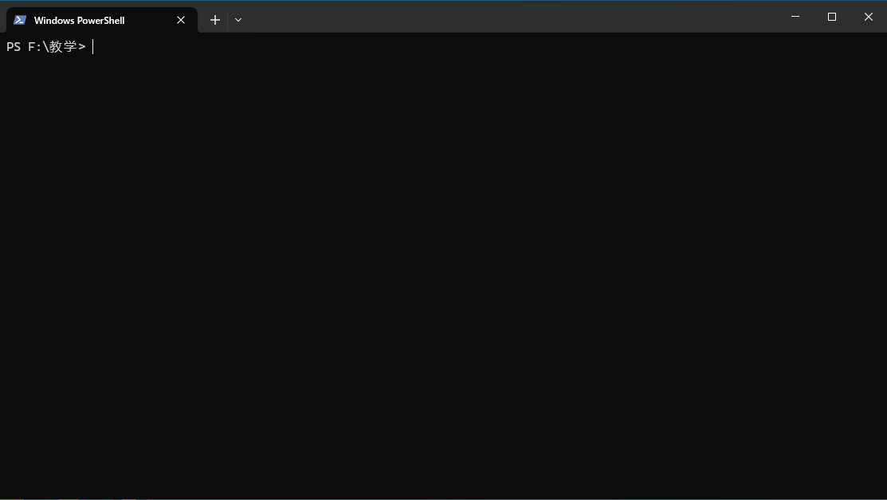
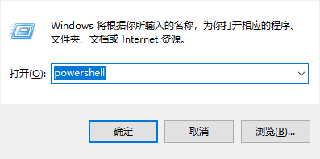
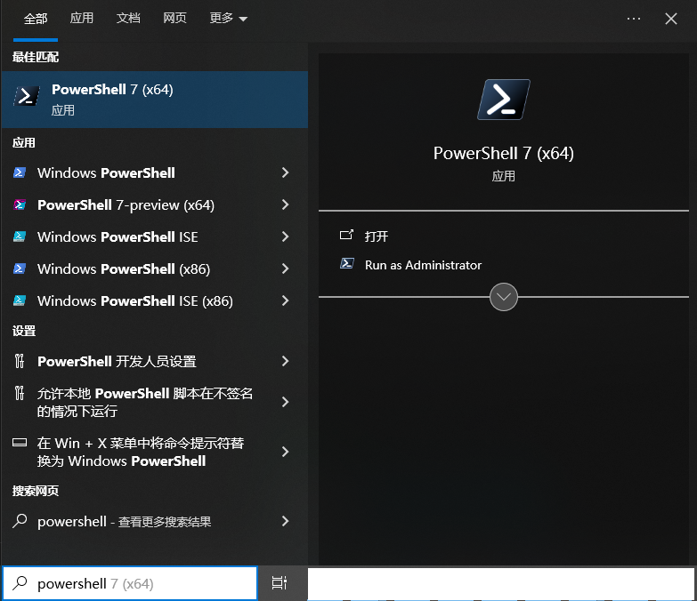
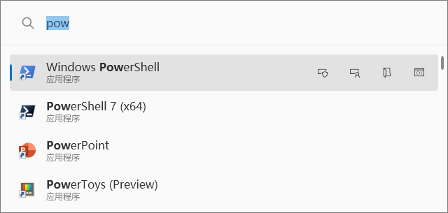
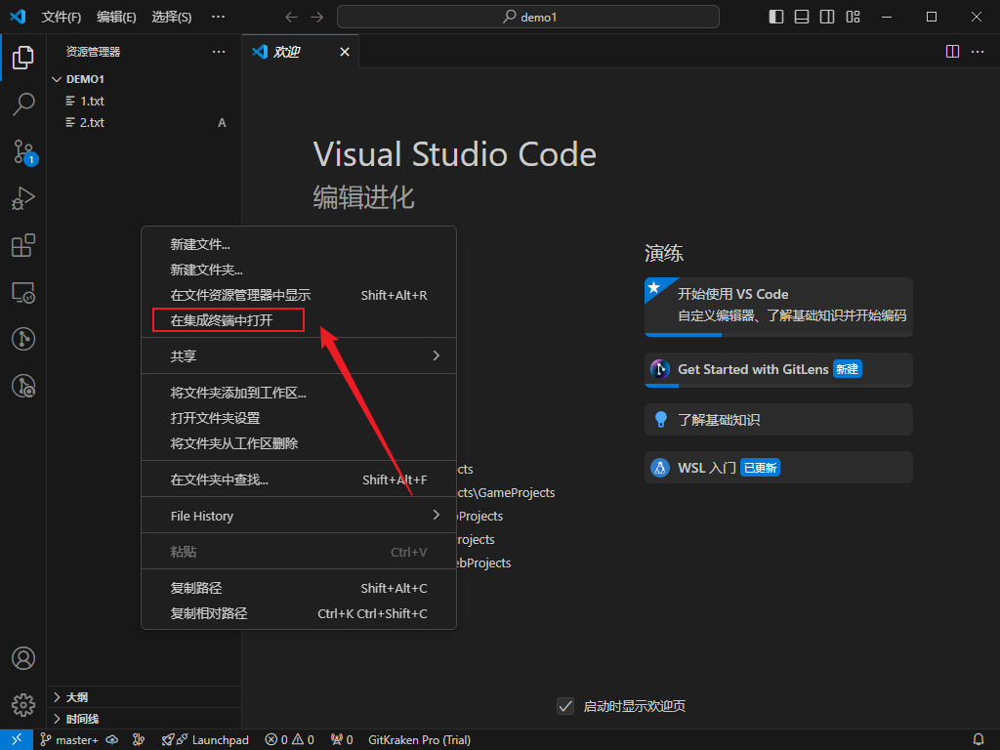
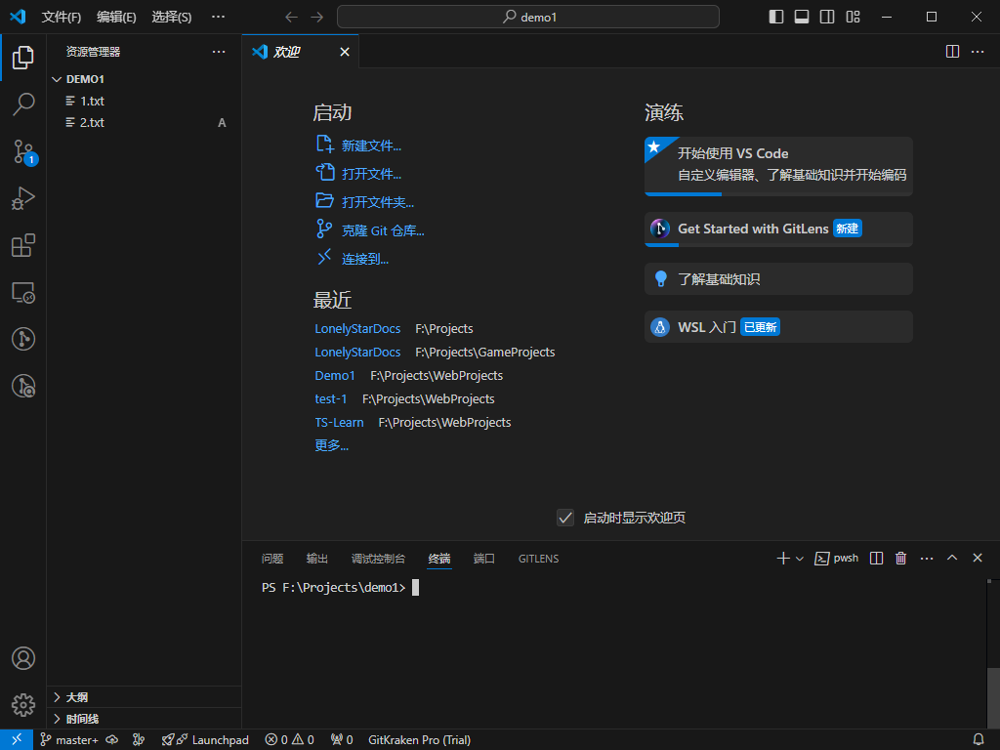
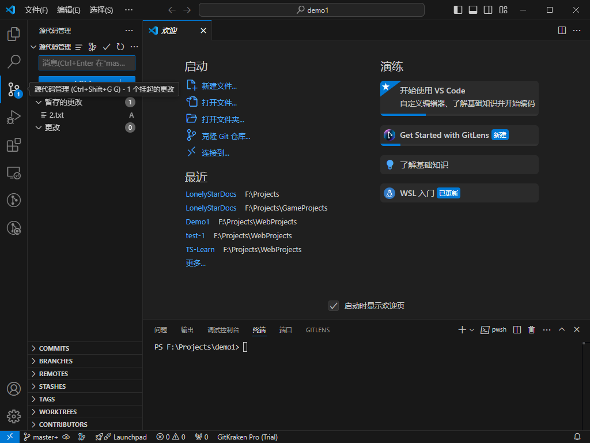

# 前置知识

## 命令行界面

命令行界面（command-line interface，CLI），区别于图形用户界面（Graphical User Interface，GUI）的方便，命令行仅能通过监听键盘输入来对用户进行反馈。可以简单理解为，远古聊天室，无法发送表情、图片，只能通过文字相互交流。换言之，你可以通过指令来要求计算机为你做些什么。

### Windows10 如何打开命令行

1. Windows + R，输入`cmd`或`powershell`
    
2. Windows搜索框搜索
    
3. 微软开源小工具[PowerToys Run](https://learn.microsoft.com/zh-cn/windows/powertoys/)，使用 alt + space（空格）可呼出，回车或点击打开。
    
4. 如果使用VS Code，右键左侧资源管理器的空白处，点击在集成终端打开。
    
    
    
 
    <!-- 如果安装了[GitLen插件](/开发工具/准备工作#VS-Code插件)可以在右侧栏管理Git。
     -->
